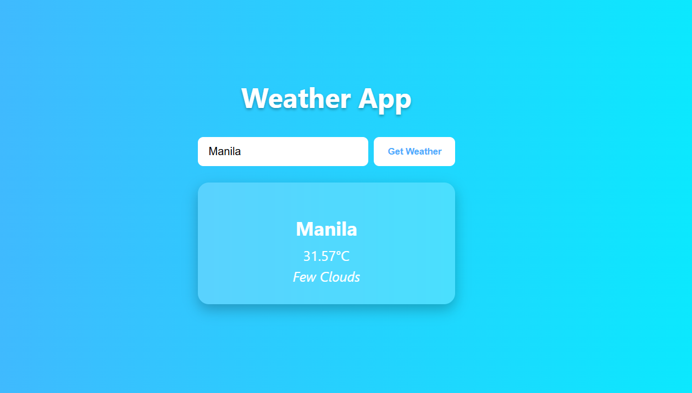

# ReactJS Weather App
A simple test of open weather api.

## Preview


## Setup
1. Clone this repository via `git clone https://github.com/khianvictorycalderon/reactjs-weather-api-demo.git`
2. Run `npm install`
3. Create an `.env` file that contains:
  ```env
  REACT_APP_WEATHER_API_KEY=<your-api-here>
  ```
4. Run `npm run dev`